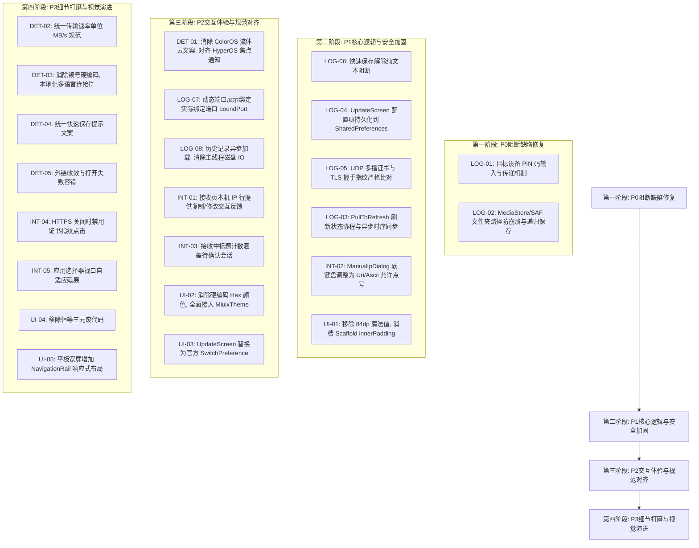

# LocalSend-Miuix 全面质量评估报告

**评估基准与范围**

| 评估维度 | 范围与准则 |
|---|---|
| **项目定位** | 针对 Xiaomi HyperOS / Miuix 设计风格的 LocalSend Android 客户端实现 |
| **技术栈** | Kotlin 2.0+ / Jetpack Compose / Miuix KMP 0.9.4-rc01 / Ktor 2.3.12 / OkHttp 4.12.0 |
| **最低支持** | Android 8.0 (API 26) / 推荐 Android 14+ (API 34) 及 Android 16 (API 36) 实时活动 |
| **评估准则** | 1. 细节规范（文本/标点/单位/一致性）；2. 业务逻辑与安全；3. 交互体验与反馈；4. UI规范与主题契合 |
| **问题严重级别定义** | **P0 (阻断级)**：核心链路中断、无法完成业务或必现崩溃；<br>**P1 (严重级)**：重要功能逻辑异常、状态无法持久化、安全隐患；<br>**P2 (主要级)**：交互预期破坏、错误处理不完善、UI规范偏离；<br>**P3 (次要级)**：细微文案、单位不一、冗余代码、特定设备边缘适配。 |

---

## 一、问题统计与总览

经过对项目代码库（数据模型、网络传输层、后台保活与通知、UI交互组件、多语言资源）的全量深度逆向考据，共识别出 **23 个具体质量问题**：

| 评估维度 | P0 (阻断) | P1 (严重) | P2 (主要) | P3 (次要) | 合计 |
|---|:---:|:---:|:---:|:---:|:---:|
| **1. 细节问题 (DET)** | 0 | 0 | 1 | 4 | **5** |
| **2. 逻辑问题 (LOG)** | 2 | 4 | 2 | 0 | **8** |
| **3. 交互问题 (INT)** | 0 | 1 | 2 | 2 | **5** |
| **4. UI视觉规范 (UI)** | 0 | 1 | 2 | 2 | **5** |
| **总计** | **2** | **6** | **7** | **8** | **23** |

---

## 二、细节问题评估 (Detail Issues)

### DET-01: HyperOS 与 ColorOS 品牌概念混淆 (OPPO“流体云”术语残留)
- **严重级别**：P2 (主要)
- **代码位置**：
  - [strings.xml:L118-L119](file:///e:/project/localsend-miuix/app/src/main/res/values/strings.xml#L118-L119) (`settings_pref_notif_perm_title`, `settings_pref_notif_perm_enabled`)
  - [strings.xml:L328, L330](file:///e:/project/localsend-miuix/app/src/main/res/values/strings.xml#L328-L330) (`notif_channel_live_desc`)
  - [AndroidManifest.xml:L96](file:///e:/project/localsend-miuix/app/src/main/AndroidManifest.xml#L96)
  - [LiveUpdatesCompat.kt:L17, L21, L48](file:///e:/project/localsend-miuix/app/src/main/java/org/localsend/miuix/notification/LiveUpdatesCompat.kt#L17-L48)
  - [TransferNotifier.kt:L22, L133, L245](file:///e:/project/localsend-miuix/app/src/main/java/org/localsend/miuix/notification/TransferNotifier.kt#L22-L245)
  - [TransferActionReceiver.kt:L10](file:///e:/project/localsend-miuix/app/src/main/java/org/localsend/miuix/notification/TransferActionReceiver.kt#L10)
- **问题现象**：
  本项目明确定义为小米澎湃 OS（Xiaomi HyperOS / Miuix）设计规范项目，但在通知设置项文案、通知渠道描述及核心代码注释中，大量充斥着竞品系统 OPPO / ColorOS 的专属名词“流体云 (Aqua Dynamics)”：
  - 界面显示：`系统通知与流体云权限`、`已开启 (传输进度与流体云胶囊提示正常)`、`显示流体云胶囊与实时传输进度`。
  - 对应英文资源 [values-en/strings.xml:L118](file:///e:/project/localsend-miuix/app/src/main/res/values-en/strings.xml#L118) 中使用的是标准原生名词 `Notifications & Live Updates`。
- **影响分析**：
  严重破坏了 HyperOS 用户的系统沉浸感与产品专业度。在小米澎湃 OS 生态中，该特性官方名称为“焦点通知”/“焦点胶囊”；在原生 Android 16+ 中则为“实时活动 (Live Updates)”。
- **修复方案**：
  将中文资源及注释统一修正为“焦点通知与实时活动”，通知渠道名称调整为“实时传输进度”。

---

### DET-02: 传输速率与数据单位格式不统一
- **严重级别**：P3 (次要)
- **代码位置**：
  - [TransferModel.kt:L100-L108, L146](file:///e:/project/localsend-miuix/app/src/main/java/org/localsend/miuix/model/TransferModel.kt#L100-L146)
  - [LiveUpdatesCompat.kt:L180-L186](file:///e:/project/localsend-miuix/app/src/main/java/org/localsend/miuix/notification/LiveUpdatesCompat.kt#L180-L186)
- **问题现象**：
  - 在 `TransferModel.kt` 中，`FileItem.formatFileSize` 产生规范的带空格双字母单位（如 `2.5 MB/s`、`512.0 KB/s`、`128 B`）。
  - 在 `LiveUpdatesCompat.kt` 的 `formatChipSpeedEta` 中，胶囊速率手写格式化为：
    ```kotlin
    val speedStr = if (speedMb >= 1.0) {
        val rounded = kotlin.math.round(speedMb * 10) / 10.0
        if (rounded == kotlin.math.floor(rounded)) "${rounded.toInt()}M/s" else "${rounded}M/s"
    } else {
        val speedKb = (session.speed / 1024L).coerceAtLeast(1L)
        "${speedKb}K/s"
    }
    ```
    此处使用了单字母无空格简写 `M/s`、`K/s`，且完全丢弃了低速下的 `B/s` 处理。
- **影响分析**：
  应用主界面传输卡片显示 `2.5 MB/s`，系统状态栏胶囊却显示 `收 2.5M/s`，同一会话在不同界面的数值单位不统一，降低严谨性。
- **修复方案**：
  在 `TransferModel.kt` 中封装统一的 `formatSpeed(speedBytes, compact = false)`，明确区分“全量展示”与“胶囊紧凑展示”模式，单位统一保持 `MB/s` 与 `KB/s`。

---

### DET-03: 多语言列表连接符与标点硬编码中文顿号
- **严重级别**：P3 (次要)
- **代码位置**：
  - [HistoryScreen.kt:L263](file:///e:/project/localsend-miuix/app/src/main/java/org/localsend/miuix/ui/screen/HistoryScreen.kt#L263) (`item.fileNames.joinToString("、")`)
  - [SendScreen.kt:L208, L283](file:///e:/project/localsend-miuix/app/src/main/java/org/localsend/miuix/ui/screen/SendScreen.kt#L208) (`" · "`)
- **问题现象**：
  `HistoryScreen.kt` 展示文件列表时直接在代码中使用中文顿号拼接：
  ```kotlin
  text = if (item.fileNames.isNotEmpty()) item.fileNames.joinToString("、") else stringResource(R.string.history_files_count, item.fileCount)
  ```
- **影响分析**：
  当用户切换到英文（English）或系统跟随非中文区域时，英文文件名会被中文全角标点截断（例如 `document.pdf、presentation.pptx`），排版明显违和。
- **修复方案**：
  在资源中增加列表连接符，或者在代码中根据当前语言环境自适应连接符（中文为 `、`，英文等其他语言为 `, `）。

---

### DET-04: 核心配置项文案多屏措辞不一致
- **严重级别**：P3 (次要)
- **代码位置**：
  - [strings.xml:L69](file:///e:/project/localsend-miuix/app/src/main/res/values/strings.xml#L69) (`receive_pref_quick_save_summary`)
  - [strings.xml:L122](file:///e:/project/localsend-miuix/app/src/main/res/values/strings.xml#L122) (`settings_pref_quick_save_desc`)
- **问题现象**：
  “快速保存 (Quick Save)”配置项在主页接收选项与全局设置页分别定义了不同的资源：
  - `receive_pref_quick_save_summary`: `自动接受同局域网所有设备的传输请求，无需每次手动确认`（动词为“接受”，文案详细）
  - `settings_pref_quick_save_desc`: `自动接收所有传入的发送请求`（动词为“接收”，文案简略）
- **影响分析**：
  同一开关项在相邻页面动词与表达风格不同，给用户造成认知歧义。
- **修复方案**：
  统一整合为单个统一文案资源，规范动词为“接收”。

---

### DET-05: 外部网络链接直接硬编码在 Composable 内部且缺乏错误兜底
- **严重级别**：P3 (次要)
- **代码位置**：
  - [SettingsScreen.kt:L242, L247, L262](file:///e:/project/localsend-miuix/app/src/main/java/org/localsend/miuix/ui/screen/SettingsScreen.kt#L242-L262)
- **问题现象**：
  GitHub 项目地址与开源许可链接直接以字面量形式硬编码在 UI 函数体内：
  ```kotlin
  ArrowPreference(
      title = stringResource(R.string.settings_pref_github_title),
      summary = "https://github.com/137458/localsend-miuix",
      onClick = {
          try {
              val intent = android.content.Intent(android.content.Intent.ACTION_VIEW, android.net.Uri.parse("https://github.com/137458/localsend-miuix"))
              context.startActivity(intent)
          } catch (_: Exception) {}
      }
  )
  ```
- **影响分析**：
  1. 链接散落各处，未来维护地址变动时容易遗漏；
  2. 使用空 `catch (_: Exception) {}` 吞掉 `ActivityNotFoundException`，在未安装浏览器或受限设备（如无 GMS 车机或手表系统）上点击无任何反应，用户以为点击失效。
- **修复方案**：
  抽取到 `Constants.kt`，并在 catch 中通过 Toast 提示 `toast_cannot_open_link`。

---

## 三、逻辑问题评估 (Logic Issues)

### LOG-01: 发送端对端 PIN 码严重缺陷 (目标设备开启 PIN 时传输必然永久失败)
- **严重级别**：P0 (阻断)
- **代码位置**：
  - [LocalSendClient.kt:L71-L73](file:///e:/project/localsend-miuix/app/src/main/java/org/localsend/miuix/network/LocalSendClient.kt#L71-L73)
  - [LocalSendManager.kt:L208](file:///e:/project/localsend-miuix/app/src/main/java/org/localsend/miuix/manager/LocalSendManager.kt#L208)
- **问题现象**：
  在 `LocalSendClient` 构造时，其获取 PIN 的 Lambda 传入的是：
  ```kotlin
  private val client = LocalSendClient(
      context = context,
      getLocalDevice = { getLocalDevice() },
      getPin = { _settings.value.pin } // 错误：传递的是本机自己的 PIN
  )
  ```
  当本机作为发送端向对端发送握手请求时：
  ```kotlin
  val urlBuilder = StringBuilder("${candidateDevice.url}${LocalSendRoutes.PREPARE_UPLOAD}")
  getPin()?.takeIf { it.isNotEmpty() }?.let { 
      urlBuilder.append("?pin=").append(URLEncoder.encode(it, "UTF-8")) 
  }
  ```
  如果对端开启了 PIN 码认证保护，需要的是**对端设置的 PIN**。当前实现却直接携带了**本机自己的接收 PIN**！如果两者不一致（绝大多数情况），对端直接返回 HTTP 401 拒绝。由于客户端既没有捕获 401 触发对端 PIN 输入弹窗，也没有在发起传输时指定目标 PIN 的机制，传输会直接以 `msg_pin_required` 报错终结。
- **影响分析**：
  凡是局域网内任意开启了 PIN 保护的对端设备（如官方桌面端、iOS 端设置了 PIN），本机均完全无法向其发送任何文件，属于核心传输协议断路缺陷。
- **修复方案**：
  1. `prepareUpload` 增加参数 `targetPin: String? = null`；
  2. 当握手捕获 HTTP 401 或判定需要 PIN 时，在 `LocalSendManager` 挂起状态中抛出 `PinRequiredException`，UI 捕获后弹窗让用户输入对端的 PIN 码并重试。

---

### LOG-02: 跨端目录/文件夹传输在 Android MediaStore 与 SAF 下路径非法崩溃与结构丢失
- **严重级别**：P0 (阻断)
- **代码位置**：
  - [LocalSendServer.kt:L125-L135, L147-L153](file:///e:/project/localsend-miuix/app/src/main/java/org/localsend/miuix/network/LocalSendServer.kt#L125-L153)
  - [LocalSendManager.kt:L835-L847](file:///e:/project/localsend-miuix/app/src/main/java/org/localsend/miuix/manager/LocalSendManager.kt#L835-L847)
- **问题现象**：
  LocalSend 官方协议规定：发送文件夹时，`FileItem.name` 包含相对路径（如 `subfolder/docs/readme.txt`）。
  在本项目的服务端保存实现中：
  1. **MediaStore 模式**：
     ```kotlin
     val displayName = uniqueMediaName(fileItem.name) // 仍为 "subfolder/docs/readme.txt"
     val values = ContentValues().apply {
         put(MediaStore.MediaColumns.DISPLAY_NAME, displayName) // 致命错误：含斜杠
         put(MediaStore.MediaColumns.RELATIVE_PATH, Environment.DIRECTORY_DOWNLOADS + "/LocalSend")
     }
     context.contentResolver.insert(collection, values)
     ```
     Android 10 (Q) 及更高版本的 MediaStore 严格禁止在 `DISPLAY_NAME` 中包含路径分隔符 `/`，一旦包含会直接抛出 `IllegalArgumentException: Primary and secondary volumes do not allow slashes in DISPLAY_NAME`！且由于 `RELATIVE_PATH` 硬编码为 `Environment.DIRECTORY_DOWNLOADS + "/LocalSend"`，原始子目录层级完全丢失。
  2. **SAF 模式**：
     ```kotlin
     val parent = DocumentFile.fromTreeUri(context, target.treeUri)
     val uniqueName = uniqueTreeName(fileItem.name, existing)
     val created = parent.createFile(fileItem.mimeType, uniqueName) // 致命错误：createFile 无法创建子目录
     ```
     SAF `DocumentFile.createFile` 无法自动根据斜杠递归建目录，而是直接失败或将整个路径特殊编码为乱码文件名。
- **影响分析**：
  当接收来自电脑端或其它手机发送的包含子文件夹的内容时，接收必现崩溃抛错，所有含目录的文件传输全部中断。
- **修复方案**：
  编写路径拆分逻辑：
  - 提取叶子文件名 `fileName = fileItem.name.substringAfterLast('/')`；
  - 提取相对子路径 `subDir = fileItem.name.substringBeforeLast('/', "")`；
  - MediaStore 写入时：`RELATIVE_PATH` 设置为 `Environment.DIRECTORY_DOWNLOADS + "/LocalSend/" + subDir`，`DISPLAY_NAME` 仅填 `fileName`；
  - SAF 模式下递归通过 `findFile` 与 `createDirectory` 创建并解析中间目录。

---

### LOG-03: 下拉刷新状态指示器同步置位导致动画与刷新反馈立即闪退
- **严重级别**：P1 (严重)
- **代码位置**：
  - [SendScreen.kt:L154-L159](file:///e:/project/localsend-miuix/app/src/main/java/org/localsend/miuix/ui/screen/SendScreen.kt#L154-L159)
- **问题现象**：
  ```kotlin
  PullToRefresh(
      isRefreshing = isRefreshing,
      onRefresh = {
          isRefreshing = true
          manager.refreshDevices() // 异步协程，立刻返回
          manager.scanSubnet()     // 异步协程，立刻返回
          isRefreshing = false    // 同步执行：在同一帧内立刻置为 false！
      },
      ...
  )
  ```
- **影响分析**：
  用户下拉释放后，刷新指示器因为 `isRefreshing = false` 在同一毫秒瞬间缩回消失，没有展示任何转圈刷新过程。用户误以为下拉刷新没有起作用，反复剧烈下拉，破坏交互反馈闭环。
- **修复方案**：
  `isRefreshing` 应由真实的后台扫描状态驱动，或者通过协程等待扫描至少完成一轮广播后才更新为 `false`：
  ```kotlin
  onRefresh = {
      coroutineScope.launch {
          isRefreshing = true
          manager.refreshDevices()
          manager.scanSubnet()
          delay(1200) // 保证合理的转圈视觉反馈
          isRefreshing = false
      }
  }
  ```

---

### LOG-04: 更新界面设置项状态全部为内存临时变量未做持久化
- **严重级别**：P1 (严重)
- **代码位置**：
  - [UpdateScreen.kt:L89, L91, L92](file:///e:/project/localsend-miuix/app/src/main/java/org/localsend/miuix/ui/screen/UpdateScreen.kt#L89-L92)
- **问题现象**：
  ```kotlin
  var isOs3Effect by remember { mutableStateOf(true) }
  var ignoredVersion by remember { mutableStateOf<String?>(null) }
  var autoCheckUpdate by remember { mutableStateOf(true) }
  ```
  在 `UpdateScreen.kt` 中，“自动检查更新”、“忽略此版本”、“HyperOS 3 流光特效”三个设置项仅仅保存在 Composable 本地 `remember` 状态中。
- **影响分析**：
  用户在界面上操作开关、选择“忽略此版本”，一旦点击返回键离开设置或应用被后台杀死，所有选择立刻丢失重置为默认值。所谓“忽略此版本”形同虚设，下一次检查依然会继续弹窗骚扰用户。
- **修复方案**：
  在 `Settings.kt` 中添加字段，统一收拢到 `SharedPreferences` 进行磁盘持久化。

---

### LOG-05: UDP 多播发现阶段缺乏真实证书指纹强校验导致伪造注入风险
- **严重级别**：P1 (严重)
- **代码位置**：
  - [DiscoveryService.kt:L152-L155](file:///e:/project/localsend-miuix/app/src/main/java/org/localsend/miuix/network/DiscoveryService.kt#L152-L155)
  - [CertificateBinding.kt](file:///e:/project/localsend-miuix/app/src/main/java/org/localsend/miuix/network/CertificateBinding.kt)
- **问题现象**：
  在 UDP 多播监听循环中：
  ```kotlin
  val dto = json.decodeFromString<DeviceDto>(text)
  val device = Device.fromDto(dto, senderIp)
  if (device.protocol.equals("https", ignoreCase = true) && device.fingerprint.isNotBlank()) {
      FingerprintTrust.trust(device.fingerprint)
  }
  onDeviceDiscovered(device)
  ```
  局域网内任何未经认证的节点只要发送一段伪造的 UDP 数据包，本机就会直接将其中声明的指纹加入全局白名单 `FingerprintTrust`。
- **影响分析**：
  虽然代码库中专门编写了 `CertificateBinding.kt` 校验工具，但该校验只用在了网段扫描的主动 HTTP 查询中，最常用的局域网 UDP 多播发现完全绕过了比对。局域网内的中间人攻击者可以借此在被发现阶段注入伪造的指纹信任。
- **修复方案**：
  UDP 发现仅记录设备信息与声明指纹，不在发现阶段调用 `FingerprintTrust.trust`；只有在与目标对端发起真实的 TLS 握手时，通过 `CertificateBinding.dtoMatchesCert` 核验握手证书与声明的一致性后再给予单次信任。

---

### LOG-06: 快速保存 (QuickSave) 逻辑反向过滤纯文本导致文本传输仍需手动审批
- **严重级别**：P1 (严重)
- **代码位置**：
  - [LocalSendServer.kt:L1351-L1356](file:///e:/project/localsend-miuix/app/src/main/java/org/localsend/miuix/network/LocalSendServer.kt#L1351-L1356)
  - [LocalSendManager.kt:L224-L232](file:///e:/project/localsend-miuix/app/src/main/java/org/localsend/miuix/manager/LocalSendManager.kt#L224-L232)
- **问题现象**：
  服务端处理对端传输请求时，判定自动接收的代码为：
  ```kotlin
  val isTextSession = fileItems.all { it.isTextMessage || it.mimeType == "text/plain" || it.mimeType == "text" }
  val accepted = if (isQuickSave() && !isTextSession) {
      true
  } else {
      onIncomingRequest(session)
  }
  ```
  如果对端发送的是一段纯文本内容，`!isTextSession` 会计算为 `false`，从而强行走 `onIncomingRequest(session)` 弹窗等待用户手动点击“接收”！
- **影响分析**：
  用户开启“快速保存”的初衷就是无感接收传输。普通文件可以直接自动接收，而更轻量的纯文本反而被强制阻断弹窗，且在手机锁屏或应用处于后台时，文本传输会因为无法人工点击弹窗而一直阻塞挂起直至客户端超时，与用户预期完全相悖。
- **修复方案**：
  只要 `isQuickSave()` 为 `true`，无论文件还是文本均直接判定为 `accepted = true` 自动接收；接收完成后由 `settings.autoCopyText` 控制是否复制到剪贴板。

---

### LOG-07: 动态端口冲突回退机制与 UI 显示脱节导致对端连接被拒
- **严重级别**：P2 (主要)
- **代码位置**：
  - [LocalSendServer.kt:L285, L293](file:///e:/project/localsend-miuix/app/src/main/java/org/localsend/miuix/network/LocalSendServer.kt#L285-L293)
  - [ReceiveScreen.kt:L119](file:///e:/project/localsend-miuix/app/src/main/java/org/localsend/miuix/ui/screen/ReceiveScreen.kt#L119)
- **问题现象**：
  当默认端口 53317 被占用时，`LocalSendServer` 会寻找候选端口并绑定到 `boundPort`（例如 53318）。但在接收主页 `ReceiveScreen` 中：
  ```kotlin
  ArrowPreference(
      title = "$primaryIp:${settings.port}", // 错误：显示的是设置中的要求端口，非实际监听端口
      summary = ...
  )
  ```
- **影响分析**：
  界面展示的是 `192.168.1.5:53317`，而底层实际监听的是 `53318`。其他设备用户在对端根据界面手动输入 IP 与端口时，必然连接被拒。
- **修复方案**：
  UI 层改用 `manager.getLocalDevice().port` 或 `server.getBoundPort()` 进行绑定展示。

---

### LOG-08: 历史记录加载在单例构造时于主线程执行同步磁盘 IO
- **严重级别**：P2 (主要)
- **代码位置**：
  - [LocalSendManager.kt:L148](file:///e:/project/localsend-miuix/app/src/main/java/org/localsend/miuix/manager/LocalSendManager.kt#L148)
  - [HistoryStore.kt:L19-L27](file:///e:/project/localsend-miuix/app/src/main/java/org/localsend/miuix/history/HistoryStore.kt#L19-L27)
- **问题现象**：
  ```kotlin
  private val _transferHistory = MutableStateFlow(historyStore.load())
  ```
  在 `LocalSendManager` 实例化（通常在 Application/Activity 启动主线程）时，直接同步执行 `file.readText()` 和 `json.decodeFromString`。
- **影响分析**：
  历史记录达到几百条并包含长文本数据时，初次启动在低端机上会产生明显的掉帧卡顿，并直接触发 Android StrictMode DiskRead 违规。
- **修复方案**：
  `_transferHistory` 初始设为 `emptyList()`，在 `start()` 协程中通过 `Dispatchers.IO` 异步加载并回填 StateFlow。

---

## 四、交互问题评估 (Interaction Issues)

### INT-01: 不可操作信息行使用带箭头的导航行 (`ArrowPreference`) 造成交互欺骗
- **严重级别**：P2 (主要)
- **代码位置**：
  - [ReceiveScreen.kt:L118-L122](file:///e:/project/localsend-miuix/app/src/main/java/org/localsend/miuix/ui/screen/ReceiveScreen.kt#L118-L122)
- **问题现象**：
  本机 IP 与端口卡片项采用了 Miuix 的 `ArrowPreference` 组件，其尾部渲染了一个明显的跳转箭头 `>`：
  ```kotlin
  ArrowPreference(
      title = "$primaryIp:${settings.port}",
      summary = ...,
      onClick = {} // 空实现
  )
  ```
- **影响分析**：
  在移动端设计规范中，右箭头强暗示“可点击进入下一级详情或弹窗编辑”。用户反复点击却没有任何响应反馈，既不能复制 IP 也不能修改端口，破坏了基本的控件 Affordance 心理预期。
- **修复方案**：
  1. 点击事件实现为：将当前 IP:Port 复制到系统剪贴板，并弹出 Toast 提示；或者点击直接弹出“修改端口”对话框。
  2. 若仅作为展示，改用普通无箭头的 `Card` 内组件。

---

### INT-02: 手动输入 IP 对话框纯数字软键盘限制无法输入 IPv4 点号
- **严重级别**：P1 (严重)
- **代码位置**：
  - [Dialogs.kt:L194](file:///e:/project/localsend-miuix/app/src/main/java/org/localsend/miuix/ui/component/Dialogs.kt#L194)
- **问题现象**：
  ```kotlin
  TextField(
      value = ip,
      onValueChange = { ip = it },
      label = stringResource(R.string.dialog_manual_ip_address_label),
      singleLine = true,
      keyboardOptions = KeyboardOptions(keyboardType = KeyboardType.Number), // 致命键盘类型
      modifier = Modifier.fillMaxWidth()
  )
  ```
- **影响分析**：
  在主流国产 Android 设备（尤其是小米澎湃 OS、ColorOS 内置的百度/搜狗输入法定制版）中，`KeyboardType.Number` 弹出的是严格的纯数字九宫格，**完全没有任何小数点 `.` 键位**！用户在弹窗中只能输入一串纯数字，根本无法输入合法的类似 `192.168.1.100` 的 IP 地址，导致该功能直接瘫痪。
- **修复方案**：
  将 `KeyboardType.Number` 调整为 `KeyboardType.Uri` 或 `KeyboardType.Ascii`。

---

### INT-03: 接收界面任务计数与正在接收列表卡片展示脱节
- **严重级别**：P2 (主要)
- **代码位置**：
  - [ReceiveScreen.kt:L154](file:///e:/project/localsend-miuix/app/src/main/java/org/localsend/miuix/ui/screen/ReceiveScreen.kt#L154)
- **问题现象**：
  接收页面正在接收会话列表上方的分区标题为：
  ```kotlin
  SmallTitle(text = stringResource(R.string.receive_section_incoming_count, incomingSessions.count { it.status == TransferStatus.InProgress }))
  ```
  当对端发起传输请求刚到达、等待本机用户确认接收（状态为 `WaitingApproval`）时，`incomingSessions` 不为空，因此卡片正常显示在列表中；但由于其状态尚未变成 `InProgress`，计算出的数量为 `0`！
- **影响分析**：
  界面上方赫然显示“正在接收 (0)”，而下方却展示着一个待审批的接收卡片，给用户造成极大的视觉困惑。
- **修复方案**：
  统计计数应涵盖等待批准状态：
  ```kotlin
  incomingSessions.count { it.status == TransferStatus.InProgress || it.status == TransferStatus.WaitingApproval }
  ```

---

### INT-04: HTTPS 未启用状态下证书指纹行仍然可点击且展示无意义高危操作
- **严重级别**：P3 (次要)
- **代码位置**：
  - [SettingsScreen.kt:L222-L226](file:///e:/project/localsend-miuix/app/src/main/java/org/localsend/miuix/ui/screen/SettingsScreen.kt#L222-L226)
  - [Dialogs.kt:L460-L469](file:///e:/project/localsend-miuix/app/src/main/java/org/localsend/miuix/ui/component/Dialogs.kt#L460-L469)
- **问题现象**：
  当用户未开启 HTTPS 时，证书指纹行显示“未生成 (请先启用 HTTPS)”，但该行仍可被点击触发打开 `CertFingerprintDialog`。弹窗中指纹内容为空，但下方依然展示可点击的红色高危按钮“重新生成”。用户点击后虽然生成了新密钥，但 HTTPS 依然是关闭的，重新打开后指纹依然显示为空。
- **影响分析**：
  逻辑不自洽，误导用户频繁点击无意义的重新生成操作。
- **修复方案**：
  当 `!settings.useHttps` 时，该偏好项直接置灰不可点（`enabled = false`），或点击时弹出确认框引导用户“是否先开启 HTTPS 功能”。

---

### INT-05: 底部应用选择弹窗高度固定且搜索状态下全选缺乏维度提示
- **严重级别**：P3 (次要)
- **代码位置**：
  - [AppPickerBottomSheet.kt:L248-L252, L273](file:///e:/project/localsend-miuix/app/src/main/java/org/localsend/miuix/ui/component/AppPickerBottomSheet.kt#L248-L273)
- **问题现象**：
  在底部应用选择弹窗中，列表高度固定写死为 `heightIn(max = 380.dp)`。在平板或横屏模式下，无法充分利用视口纵向高度；此外，在有搜索关键词过滤的场景下，“全选当前”按钮点击后，如果用户清空搜索框，很难直观了解已选中的应用究竟是仅包含过滤结果还是全部应用。
- **影响分析**：
  大屏体验不佳，且批量选择应用时的状态不确定性容易导致误发。
- **修复方案**：
  列表高度采用动态视口高度计算（如根据 `LocalConfiguration.current.screenHeightDp` 动态设定权重），并在搜索状态下的全选按钮动态展示为“全选当前筛选 (%d 项)”。

---

## 五、UI 与视觉规范问题 (UI Issues)

### UI-01: 底栏内边距硬编码魔法数值破坏动态视口与横竖屏适配
- **严重级别**：P1 (严重)
- **代码位置**：
  - [App.kt:L285, L355](file:///e:/project/localsend-miuix/app/src/main/java/org/localsend/miuix/ui/App.kt#L285-L355)
- **问题现象**：
  主界面底栏留白直接手写魔法数值：
  ```kotlin
  val navBarBottomPadding = WindowInsets.navigationBars.asPaddingValues().calculateBottomPadding()
  val bottomBarTotalPadding = 84.dp + navBarBottomPadding
  ...
  val pagePadding = PaddingValues(
      top = innerPadding.calculateTopPadding(),
      bottom = bottomBarTotalPadding // 绕过了 Scaffold 提供的 innerPadding
  )
  ```
- **影响分析**：
  Miuix 官方 `Scaffold` 在 `bottomBar` 槽位放置组件时，其回调给主体的 `innerPadding.calculateBottomPadding()` 已经精确计算了底部组件高度与系统导航栏边距。强制使用硬编码的 `84.dp` 会导致在传统三键虚拟导航栏、分屏、悬浮窗以及折叠屏展开态下，内容底部出现严重不一致的留白过大或内容遮挡。
- **修复方案**：
  严格遵循 Compose 与 Miuix 架构契约，直接消费 `innerPadding.calculateBottomPadding()` 作为页面底部内边距。

---

### UI-02: 状态与动作颜色直接硬编码破坏 Miuix 主题及暗色/Monet 规范
- **严重级别**：P2 (主要)
- **代码位置**：
  - [TransferSessionCard.kt:L570, L666, L739, L787](file:///e:/project/localsend-miuix/app/src/main/java/org/localsend/miuix/ui/component/TransferSessionCard.kt#L570-L787) (`Color(0xFF4CAF50)`)
  - [HistoryScreen.kt:L302-L304](file:///e:/project/localsend-miuix/app/src/main/java/org/localsend/miuix/ui/screen/HistoryScreen.kt#L302-L304) (`Color(0xFF16A34A)`, `Color(0xFFDC2626)`, `Color(0xFFF59E0B)`)
  - [HistoryScreen.kt:L191](file:///e:/project/localsend-miuix/app/src/main/java/org/localsend/miuix/ui/screen/HistoryScreen.kt#L191) (`contentColor = Color.White`)
  - [Dialogs.kt:L465](file:///e:/project/localsend-miuix/app/src/main/java/org/localsend/miuix/ui/component/Dialogs.kt#L465) (`contentColor = androidx.compose.ui.graphics.Color.White`)
- **问题现象**：
  在传输卡片、历史记录项和对话框中，多次出现直接硬编码的固定颜色：
  - 成功绿色：`Color(0xFF4CAF50)`、`Color(0xFF16A34A)`
  - 失败红色：`Color(0xFFDC2626)`
  - 取消黄色：`Color(0xFFF59E0B)`
  - 按钮文字：`Color.White`
- **影响分析**：
  硬编码色彩完全脱离了 `MiuixTheme.colorScheme` 的动态主题调色盘体系。在用户开启 Monet 动态取色、系统暗色深灰模式、或系统高对比度无障碍显示时，固定颜色无法自适应变色，极易造成对比度过低、反光刺眼或色彩风格割裂。
- **修复方案**：
  统一替换为 Miuix 官方颜色令牌：失败采用 `MiuixTheme.colorScheme.error`，主态采用 `primary`，次态采用 `onSurfaceVariantSummary`，按钮前景采用 `onPrimary` / `onError`。

---

### UI-03: 偏离 Miuix 偏好项体系手动拼装基础组件违背设计统一性
- **严重级别**：P2 (主要)
- **代码位置**：
  - [UpdateScreen.kt:L400-L430](file:///e:/project/localsend-miuix/app/src/main/java/org/localsend/miuix/ui/screen/UpdateScreen.kt#L400-L430)
- **问题现象**：
  升级页面的“自动检查更新”和“忽略此版本”设置项采用了 `BasicComponent` 在 `endActions` 槽位手动嵌入 `Switch` 的写法：
  ```kotlin
  BasicComponent(
      title = stringResource(R.string.update_pref_auto_check_title),
      summary = stringResource(R.string.update_pref_auto_check_summary),
      endActions = {
          Switch(
              checked = autoCheckUpdate,
              onCheckedChange = { checked -> autoCheckUpdate = checked }
          )
      }
  )
  ```
- **影响分析**：
  整个项目在设置页和接收页均全面统一采用 `top.yukonga.miuix.kmp.preference.SwitchPreference`。手动手拼破坏了官方规范中的整行可点（点击行文字也能触发切换）、统一的行高规范与内置平滑触感水波纹。
- **修复方案**：
  直接替换为 `SwitchPreference`。

---

### UI-04: 存在毫无意义的恒等三元条件渲染死分支代码
- **严重级别**：P3 (次要)
- **代码位置**：
  - [HistoryScreen.kt:L229](file:///e:/project/localsend-miuix/app/src/main/java/org/localsend/miuix/ui/screen/HistoryScreen.kt#L229)
- **问题现象**：
  ```kotlin
  Icon(
      imageVector = if (item.isTextMessage) Icons.Default.ChatBubbleOutline else if (item.isIncoming) Icons.Default.Download else Icons.AutoMirrored.Filled.Send,
      contentDescription = null,
      tint = if (item.isTextMessage) MiuixTheme.colorScheme.primary else MiuixTheme.colorScheme.primary, // 恒等废代码
      modifier = Modifier.size(24.dp)
  )
  ```
- **影响分析**：
  三元运算符的 true 与 false 分支结果完全一致，属于明显的低级复制粘贴遗留代码异味（Code Smell），影响代码整洁性。
- **修复方案**：
  直接简化为 `tint = MiuixTheme.colorScheme.primary`，或者修正原本意图（如文本消息与其他文件使用不同层次的颜色）。

---

### UI-05: 大屏幕与平板横屏模式缺乏 NavigationRail 响应式布局
- **严重级别**：P3 (次要)
- **代码位置**：
  - [App.kt:L320-L341](file:///e:/project/localsend-miuix/app/src/main/java/org/localsend/miuix/ui/App.kt#L320-L341)
  - [LiquidGlassBottomBar.kt](file:///e:/project/localsend-miuix/app/src/main/java/org/localsend/miuix/ui/component/LiquidGlassBottomBar.kt)
- **问题现象**：
  应用主界面无条件将导航栏渲染为屏幕底部的横向悬浮栏 `LiquidGlassBottomBar`。在横屏状态或平板（窗口宽度 >= 600dp）下，底栏侵占了宝贵的纵向显示高度，且横向大量留白。
- **影响分析**：
  未遵从 Miuix / HyperOS 多端自适应（Large Screen / Pad Adaptation）设计规范，在大屏与折叠屏展开态下视觉比例失调。
- **修复方案**：
  在宽屏模式下引入自适应断点（`WindowWidthSizeClass.Expanded` 或宽度 >= 600dp），将底部导航自适应切换为侧边导航栏（`NavigationRail`），释放纵向空间。

---

## 六、整改优先级与执行建议路线图

基于对业务影响面和实现成本的综合评估，推荐的整改路线如下：


